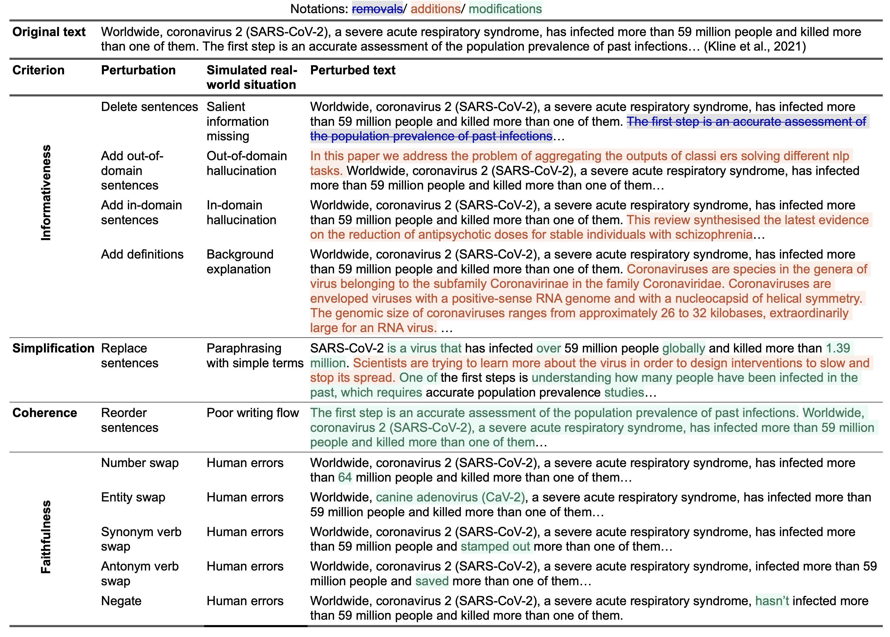

#  APPLS
This repository contains the code for POMME score from APPLS: : [A Meta-evaluation Testbed for Plain Language Summarization](https://arxiv.org/pdf/2305.14341.pdf).

## Updates

## Overview

The goal of this repository is to assess how well existing metrics capture the multiple criteria of PLS. We identify four criteria, informed by prior work, that a PLS metric should be sensitive to: **informativeness**, **simplification**, **coherence**, and **faithfulness**. We introduce a set of perturbations to probe metric sensitivity to these criteria, where each perturbation is designed to affect a single criterion with ideally minimal impact to others.

 Example perturbations for criteria in APPLS. Original text comes from the CELLS study.


## Perturbing Your Dataset

If you’d like to perturb your dataset to see how well existing metrics capture your text, please follow these steps to build the testbed using your dataset:

1. **Prepare Your Dataset**:
   - The input dataset should be in a CSV file with two columns named “id” and “reference text”, representing the index of the text and the original text to be perturbed.

2. **Run the Code**:
   - For tasks other than entity_swap, use the following code:
     ```bash
     python main.py \
            --task simplification \
            --input_file $input_file \
            --input_path $DATA_PATH \
            --output_path $DATA_PATH
     ```

   - For the entity_swap task, follow these additional steps:
     1. Follow the [claim generation repository instructions](https://github.com/allenai/scientific-claim-generation) to install the necessary packages.
     2. Change the `scientific_claim_folder` in `factual_consistency_entity_swap.py`.
     3. Run `main_entity_swap.py`.

## Evaluation

This project analyzes **8 established evaluation metrics**, including the **5 most commonly reported metrics** in ACL'22 summarization and generation papers. Additionally, we assess **5 lexical features** associated with text simplification and perform **LLM-based evaluations**.

---

### Lexical Features
To evaluate lexical features, use the script: ./evaluation/lexical_features/eval_difficulty.py

#### Specificity Calculation
For the **specificity** metric among lexical features, we utilize **Speciteller**, a domain-agnostic tool to compute the specificity of terms in a paragraph. You can find Speciteller here: [https://github.com/jjessyli/speciteller](https://github.com/jjessyli/speciteller).

---

### LLM-Based Evaluation
To conduct LLM-based evaluations, execute the following script: ./evaluation/gpt/run_gpt.sh

#### Instructions
1. Modify the code path in `run_gpt.sh` to match your environment.
2. Enter your API key in the `utils` file to enable GPT-based evaluations.


## POMME score
1. Begin by cloning this repository. Then, install the necessary packages listed in requirements.txt by creating a Conda environment:
```
conda create --name pomme --file requirements.txt
```

2. Place your test.csv file into the ./data/ directory. This file needs to have two columns: 'id' and 'perturbed_text'. The 'id' column should contain the text's identifier, while 'perturbed_text' is the specific text you wish to analyze.

3. Navigate to the ./pomme/run_pomme.sh script. Here, you should modify the script to specify the file name and choose the desired in-domain and out-domain models for your evaluation. 

4. The default reference dataset is located in ./data/ref/ and originates from the [CELLS dataset](https://github.com/LinguisticAnomalies/pls_retrieval). Feel free to replace this with another dataset of your choice for reference purposes. An example CSV file is provided in ./data/ as a guide for running the code.

## References

Guo, Y., et al. (2022). CELLS: A Comprehensive Benchmark for Evaluation of Language Model Outputs.

For further assistance or questions, feel free to open an issue in this repository.

## Citation
```
@article{guo2023appls,
  title={APPLS: A Meta-evaluation Testbed for Plain Language Summarization},
  author={Guo, Yue and August, Tal and Leroy, Gondy and Cohen, Trevor and Wang, Lucy Lu},
  journal={arXiv preprint arXiv:2305.14341},
  year={2023}
}
```
